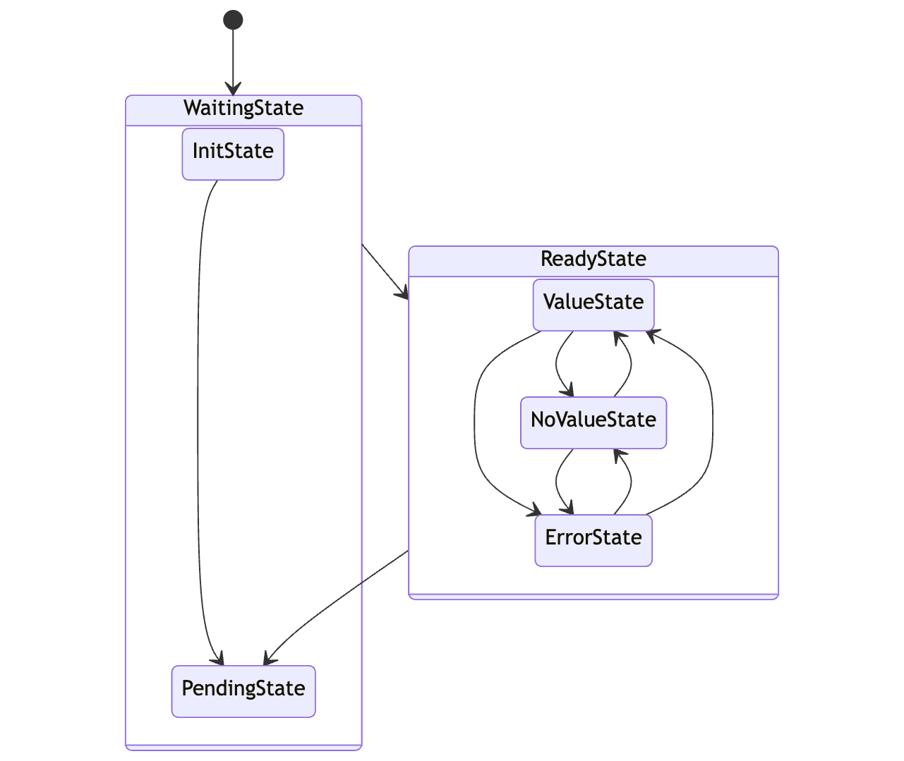
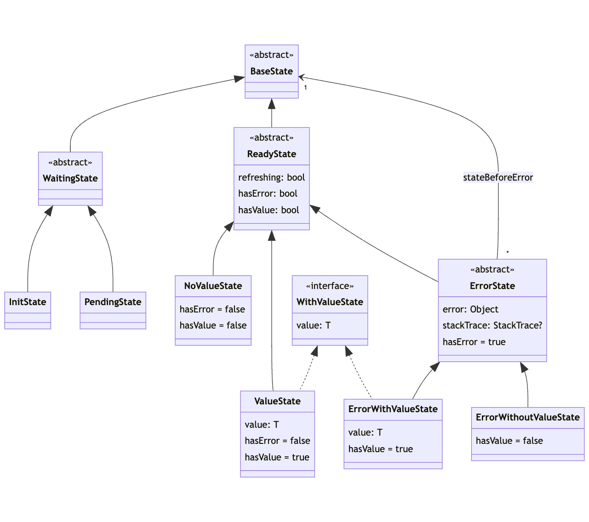

A dart package that helps to implement basic states for [BLoC library](https://pub.dev/packages/bloc) to perform, load and fetch data.


[](https://pub.dev/packages/value_cubit)
[](https://github.com/devobs/value_cubit/actions/workflows/test.yml)
[](https://codecov.io/gh/devobs/value_cubit)
[](https://opensource.org/licenses/MIT)

## Features

* Provides all necessary states for data : init, waiting, value/no value and error states,
* A `ValueCubit` class to simplify `Cubit` subclassing,
* A `RefreshValueCubit` class like `ValueCubit` with refreshing capabilities,
* Some helpers `perform` (an extension on `Cubit`) to emit intermediate states while an action is intended to update state : the same state is reemitted with attribute `refreshing` at `true`.

## Usage

### Basic example

```dart
class CounterCubit extends ValueCubit<int> {
  var _value = 0;

  // Put your WS call that can be refreshed
  Future<int> _getCounterValueFromWebService() async => _value++;

  Future<void> increment() => perform(() async {
        // [perform] generate intermediate or final states such as PendingState,
        // concrete subclass of ReadyState with right [ReadyState.refreshing] value
        // or ErrorState if an error is raised.
        final result = await _getCounterValueFromWebService();

        emit(ValueState(result));
      });

  void clear() {
    _value = 0;
    emit(const PendingState());
  }
}

main() async {
  final counterCubit = CounterCubit();

  counterCubit.increment(); // to emit first value

  await for (final state in counterCubit.stream) {
    if (state is WaitingState<int>) {
      print('Waiting for value');
    } else if (state is ReadyState<int>) {
      // smart cast [state] in [ReadyState] to access [ReadyState.hasError] attribute
      if (state.hasError) {
        print('Error');
      } else if (state is WithValueState<int>) {
        // deeper smart cast of [state] in [WithValueState] to access [WithValueState.value]
        // attribute.
        print('Value : ${state.value}');
      }
    }
  }

  // increment values 2 times
  counterCubit.increment();
  counterCubit.increment();
}
```

If your cubit is only a getter with the need to refresh your cubit state, you can simplify the implementation `ValueCubit` with `RefreshValueCubit`.

```dart
class CounterCubit extends RefreshValueCubit<int> {
  var _value = 0;

  // Put your WS call that can be refreshed
  Future<int> _getCounterValueFromWebService() async => _value++;

  @override
  Future<void> emitValues() async {
    final result = await _getCounterValueFromWebService();

    emit(ValueState(result));
  }
}
```

Update your value (increment in our example) by calling `myCubit.refresh()`.

### With Flutter and [Flutter BLoC library](https://pub.dev/packages/flutter_bloc)

This example shows how different value states from this library help developpers to show load step data widgets.

```dart
class MyHomePage extends StatelessWidget {
  const MyHomePage({super.key});

  @override
  Widget build(BuildContext context) {
    const progressIndicator = CircularProgressIndicator();
    final theme = Theme.of(context);

    return BlocBuilder<CounterCubit, BaseState<int>>(builder: (context, state) {
      return Scaffold(
        appBar: AppBar(
          title: const Text('Flutter Demo Home Page'),
        ),
        body: DefaultTextStyle(
          style: const TextStyle(fontSize: 24),
          textAlign: TextAlign.center,
          child: state is ReadyState<int>
              ? Column(
                  crossAxisAlignment: CrossAxisAlignment.stretch,
                  children: <Widget>[
                    // state is now smart casted in [ReadyState] with
                    // `state is ReadyState<int>`:
                    // [ReadyState.refreshing] and [ReadyState.hasError]
                    // are reachable.
                    if (state.refreshing) const LinearProgressIndicator(),
                    const Spacer(),
                    if (state.hasError)
                      Text('Expected error.',
                          style: TextStyle(color: theme.errorColor)),
                    if (state is WithValueState<int>) ...[
                      // Deeper smart cast in [WithValueState],
                      // [WithValueState.value] is reachable.
                      const Text('Actual counter value :'),
                      Text(
                        state.value.toString(),
                        style: theme.textTheme.headline4,
                      ),
                    ],
                    if (state is NoValueState<int>) const Text('No Value'),
                    const Spacer(),
                  ],
                )
              : const Center(child: progressIndicator),
        ),
        floatingActionButton: state is! ReadyState<int>
            ? null
            : FloatingActionButton(
                onPressed: state.refreshing
                    ? null
                    : context.read<CounterCubit>().increment,
                tooltip: 'Increment',
                child: state.refreshing
                    ? const SizedBox.square(
                        dimension: 20, child: progressIndicator)
                    : const Icon(Icons.refresh)),
      );
    });
  }
}
```

The whole code of this example is available in [example/flutter](example/flutter).

## Models

### State Diagram



### Class Diagram



## Feedback

Please file any issues, bugs or feature requests as an issue on the [Github page](https://github.com/devobs/value_cubit/issues).
